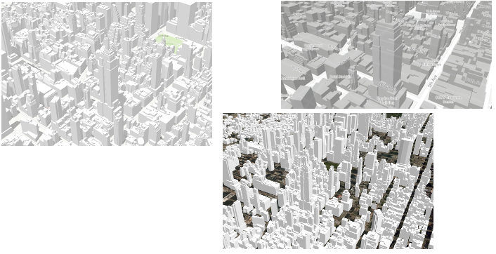
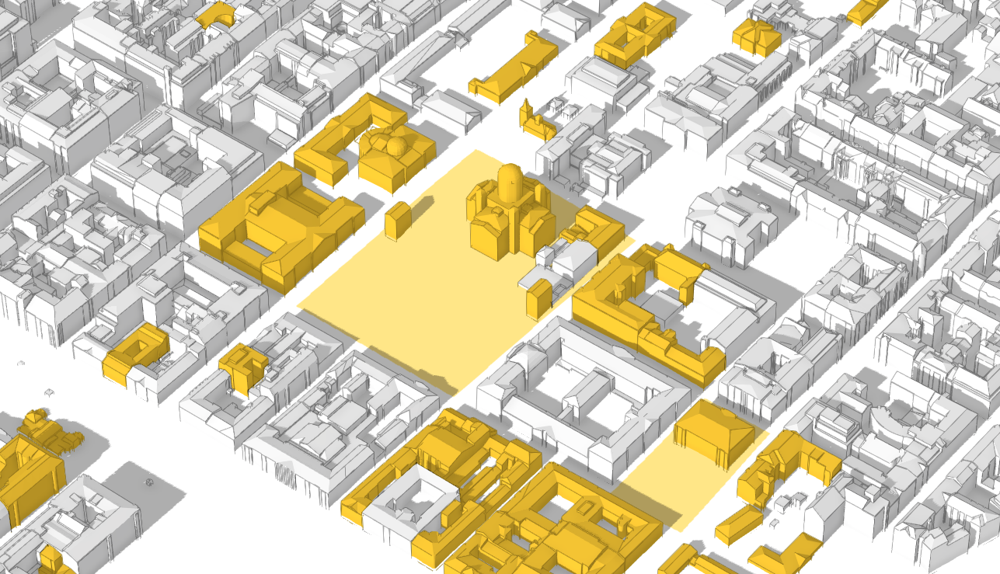
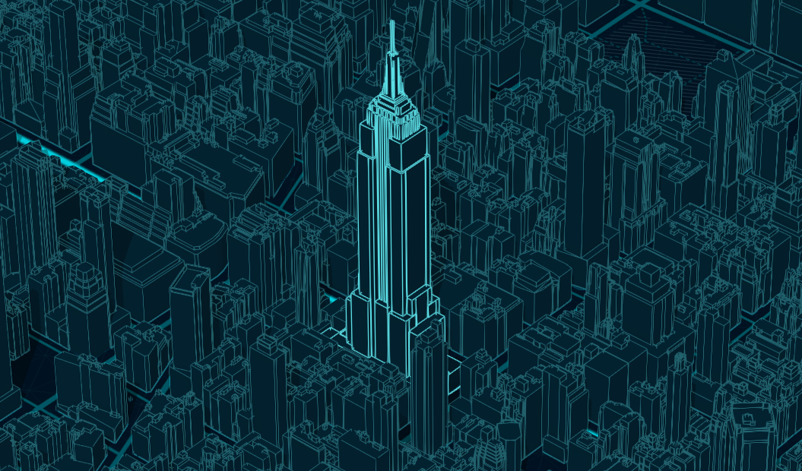
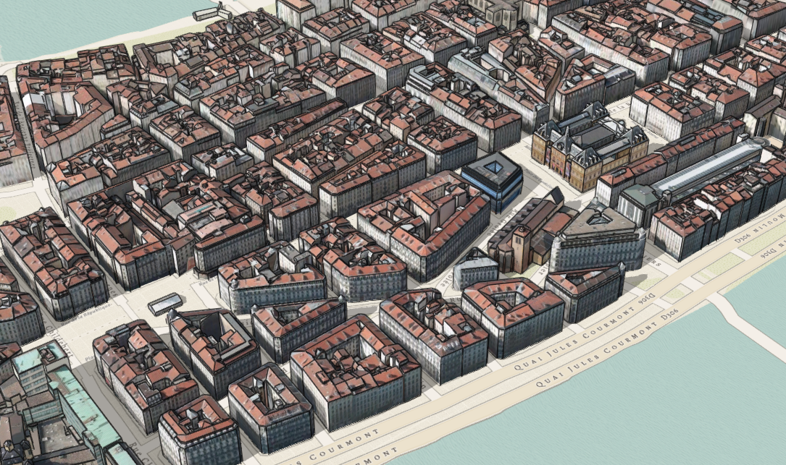

## Edge Rendering

In this project I use edge rendering and vector tile basemaps to visualize 3D urban environments on the web. Such visualizations could be used for urban projects or for touristic maps.

Most 3D city web visualization look like this:



What could they look like when (ab)using edge rendering?

#### Urban planning visualization



```ts
symbol: new MeshSymbol3D({
  symbolLayers: [
    new FillSymbol3DLayer({
      material: {
        color: "#ffffff",
        colorMixMode: "replace"
      },
      edges: new SolidEdges3D({
        color: [0, 0, 0, 0.9],
        size: 1
      })
    })
  ]
});
```

[Helsinki buildings on ArcGIS Online](http://www.arcgis.com/home/item.html?id=5ecba5273b2d41ff9f6f1eb33f238d18)


#### Touristic map:


```ts
symbol: new MeshSymbol3D({
  symbolLayers: [
    new FillSymbol3DLayer({
      material: {
        color: "#ffffff",
        colorMixMode: "replace"
      },
      edges: new SketchEdges3D({
        color: [121, 69, 211, 1],
        size: 2,
        extensionLength: 3
      })
    })
  ]
});
```

[Buildings by Esri France](http://www.arcgis.com/home/item.html?id=6833ae218ffb40d591f4b0f802f3f069)

[Vector tile basemap by Jaime Nieves](http://www.arcgis.com/home/item.html?id=0d5695666b4c46d6abb5715fc0572d6b)


#### The James Bond type of map...the 3D James Bond type of map:



```ts
symbol: new MeshSymbol3D({
  symbolLayers: [new FillSymbol3DLayer({
    material: {
      color: "#001d2d"
    },
    edges: new SolidEdges3D({
      size: 3,
      color: "#69dde5"
    })
  })]
});
```

[New York building data provided by DoITT on ArcGIS Online](https://tiles.arcgis.com/tiles/cFEFS0EWrhfDeVw9/arcgis/rest/services/Buildings_Manhattan/SceneServer)

[Nova basemap by Esri Basemaps team](http://www.arcgis.com/home/item.html?id=8d91bd39e873417ea21673e0fee87604)

#### Oldies but goldies style




```ts
symbol: new MeshSymbol3D({
  symbolLayers: [
    new FillSymbol3DLayer({
      edges: new SolidEdges3D({
        color: [0, 0, 0, 0.7],
        size: 2,
      })
    })
  ]
})
```

[Lyon building data by Esri France](http://www.arcgis.com/home/item.html?id=49a3382716e841aeb8f79fc1f388e0f1)

[Modern antique basemap by Esri basemaps team](http://www.arcgis.com/home/item.html?id=effe3475f05a4d608e66fd6eeb2113c0)

## Setup

```
git clone https://github.com/RalucaNicola/edge-rendering.git

npm install

// start local project
npm run start

// build for production
npm run build
```

View this project live at: http://raluca-nicola.net/edge-rendering/index.html


[MIT License](./LICENSE)

Forks, PRs and new style suggestions are welcome!